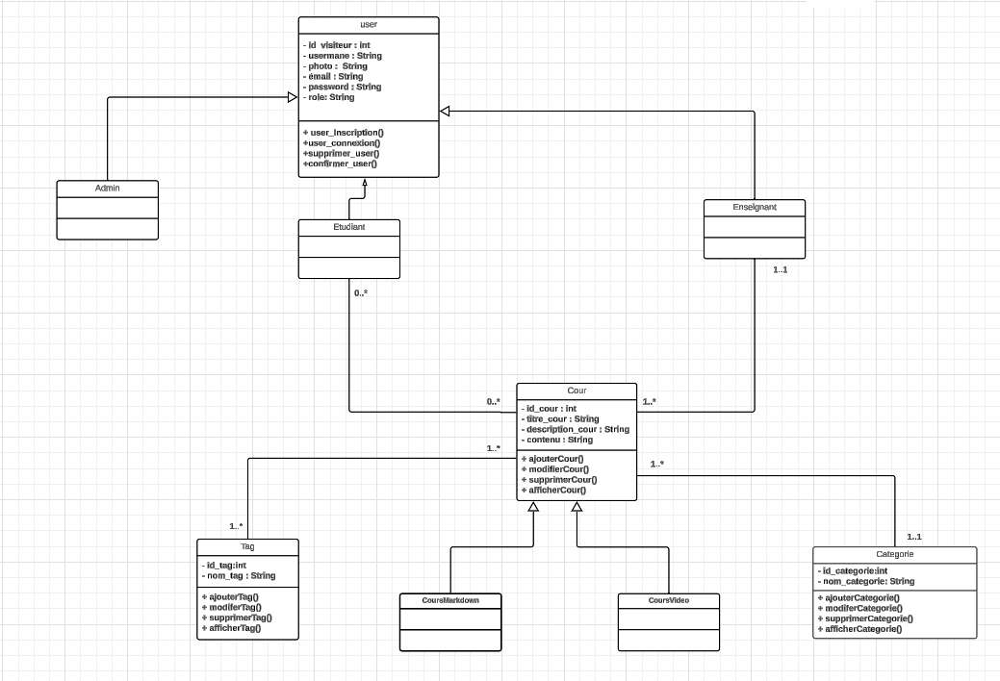
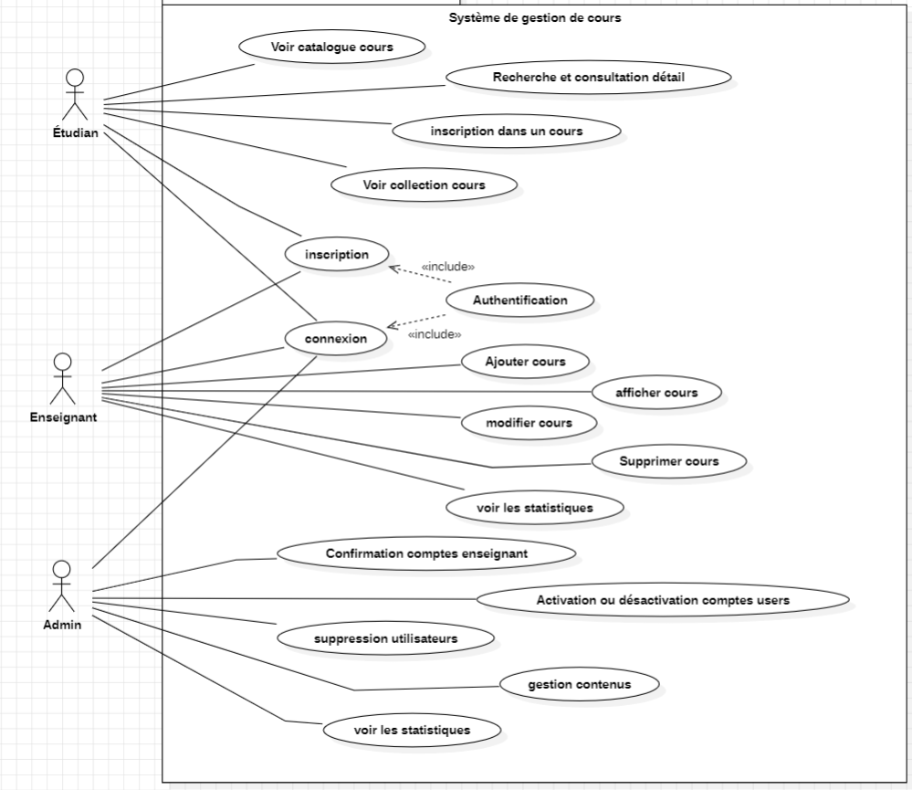
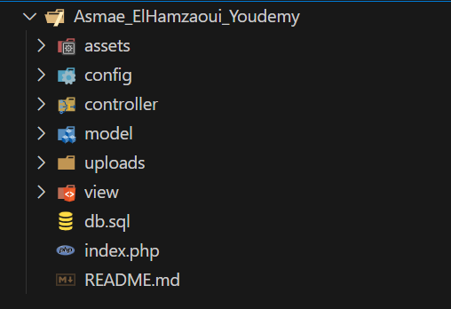

# Asmae_ElHamzaoui_Youdemy

## Contexte du projet
La plateforme de cours en ligne Youdemy vise à révolutionner l’apprentissage en proposant un système interactif et personnalisé pour les étudiants et les enseignants .

## Fonctionnalités principales

**Intégration UI et Ajout Dynamique**

-   Formulaires permettant l'ajout des utilisateurs avec des champs .
-   Formulaires permettant l'ajout des cours , catégories et des tags avec des champs .

**L'affichage des interfaces**
-   Permettre l'affichage des utilisateurs
-   Permettre l'affichage des cours
-   Permettre l'affichage des professeurs
-   Permettre l'affichage des tags,catégories .

## Technologies Requises
-   HTML
-   CSS tailwind 
-   JS  natif
-   PHP natif
-   SQL ( base de donnée MySQL)

## Table des matières

-  Lien vers le repository GitHub contenant :[Repo · Asmae_Elhamzaoui_Youdemy](https://github.com/Youcode-Classe-E-2024-2025/Asmae_ElHamzaoui_Youdemy)

-  Le diagramme de class :
 

-  Le diagramme du cas d'utilisation :
 

## Installation

### Cloner le dépôt

Pour installer et démarrer l'application, commencez par cloner ce dépôt sur votre machine locale :
 

# Installation et Configuration du Projet

## Prérequis

Avant de cloner ce projet, assurez-vous d'avoir les outils suivants installés :

1. **Serveur Web** : Apache (inclus dans XAMPP, WAMP, ou MAMP).
2. **Base de Données** : MySQL.
3. **PHP** : Version compatible avec les scripts utilisés (au minimum PHP 7.4 recommandé).
4. **Git** : Pour cloner le dépôt.

## Installation

### Étape 1 : Cloner le projet

```bash
git clone https://github.com/Youcode-Classe-E-2024-2025/Asmae_ElHamzaoui_Youdemy
cd Asmae_ElHmazaoui_Youdeme
```

### Étape 2 : Configuration de l'environnement

1. **Serveur Apache et MySQL**  
   - Utilisez un logiciel comme XAMPP, WAMP, ou MAMP pour démarrer Apache et MySQL.  
   - Placez les fichiers du projet dans le répertoire `htdocs` (pour XAMPP) ou dans le répertoire équivalent de votre serveur local.

2. **Base de Données**  
   - Ouvrez phpMyAdmin (accessible via `http://localhost/phpmyadmin`).  
   - Créez une base de données avec le nom  : `coursbase`.  
   - Importez le fichier SQL contenant la structure et les données :
     - Si votre fichier SQL n'existe pas, créez-le et ajoutez-le au dépôt pour faciliter l'installation.

3. **Fichier de Configuration**  
   - Vérifiez le fichier `db.php` et mettez à jour les paramètres de connexion à la base de données si nécessaire :
     ```php
     $servername = "localhost";
     $username = "root"; // Nom d'utilisateur MySQL par défaut
     $password = "";     // Mot de passe par défaut (vide pour XAMPP)
     $dbname = "coursbase";
     ```

### Étape 3 : Exécution du projet

1. Lancez le serveur Apache et MySQL via votre environnement local (exemple : XAMPP).
2. Accédez à votre projet en ouvrant un navigateur et en allant à l'adresse suivante :
   ```
   http://localhost/Asmae_ElHmazaoui_Youdemy
   ```

## Fonctionnalités

- **Formulaires dynamiques** : Gestion via PHP et JavaScript.
- **Interaction avec une base de données MySQL** : Stockage et récupération des données.
- **Style et animations** : Ajoutés avec CSS(tailwind) et JavaScript.

## Structure du Projet
 
## Outils Utilisés

- **Serveur Web Apache** : Hébergement du projet localement.
- **MySQL** : Base de données pour stocker les informations.
- **PHP** : Traitement côté serveur.
- **HTML, CSS, JavaScript** : Frontend du projet.